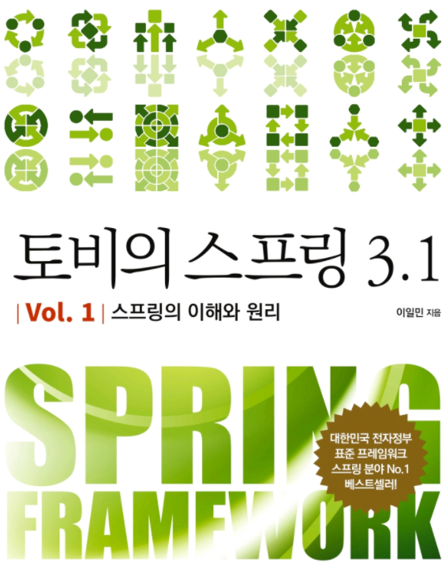

<h2>토비의 스프링 3.1 (이일민)</h2>

<h2>contents</h2>

1. 오브젝트와 의존관계
    1. 초난감 DAO
    2. DAO의 분리
    3. DAO의 확장
    4. 제어의 역전(IoC)
    5. 스프링의 IoC
    6. 싱글톤 레지스트리와 오브젝트 스코프
    7. 의존관계 주입(DI)
    8. XML을 이용한 설정
    9. 정리
2. 테스트
    1. UserDaoTest 다시 보기
    2. UserDaoTest 개선
    3. 개발자를 위한 테스팅 프레임워크 JUnit
    4. 스프링 테스트 적용
    5. 학습 테스트로 배우는 스프링
    6. 정리
3. 템플릿
    1. 다시 보는 초난감 DAO
    2. 변하는 것과 변하지 않는 것
    3. JDBC 전략 패턴의 최적화
    4. 컨텍스트와 DI
    5. 템플릿과 콜백
    6. 스프링의 JdbcTemplate
    7. 정리
4. 예외
    1. 사라진 SQLException
    2. 예외 전환
    3. 정리
5. 서비스 추상화
    1. 사용자 레벨 관리 기능 추가
    2. 트랜잭션 서비스 추상화
    3. 서비스 추상화와 단일 책임 원칙
    4. 메일 서비스 추상화
    5. 정리
6. AOP
    1. 트랜잭션 코드의 분리
    2. 고립된 단위 테스트
    3. 다이내믹 프록시와 팩토리 빈
    4. 스프링의 프록시 팩토리 빈
    5. 스프링 AOP
    6. 트랜잭션 속성
    7. 애노테이션 트랜잭션 속성과 포인트컷
    8. 트랜잭션 지원 테스트
    9. 정리
7. 스프링 핵심 기술의 응용
    1. SQL과 DAO의 분리
    2. 인터페이스의 분리와 자기참조 빈
    3. 서비스 추상화 적용
    4. 인터페이스 상속을 통한 안전한 기능확장
    5. DI를 이용해 다양한 구현 방법 적용하기
    6. 스프링 3.1의 DI
    7. 정리
8. 스프링이란 무엇인가?
    1. 스프링의 정의
    2. 스프링의 목적
    3. POJO 프로그래밍
    4. 스프링의 기술
    5. 정리
9. 스프링 프로젝트 시작하기
    1. 자바 엔터프라이즈 플랫폼과 스프링 애플리케이션성
    2. 개발도구와 환경
    3. 애플리케이션 아키텍처
    4. 정리
